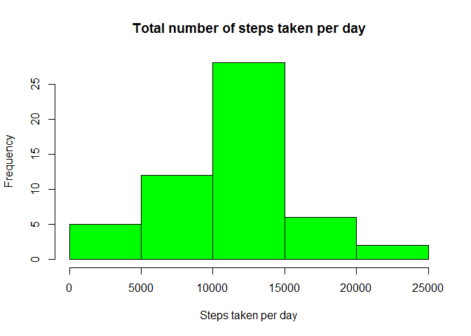
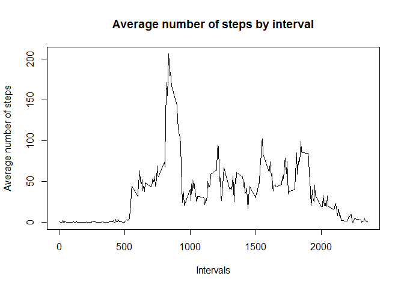
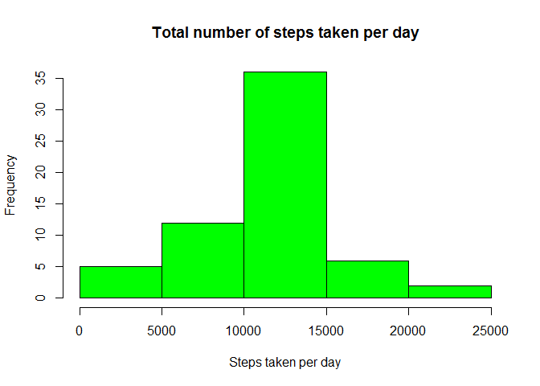
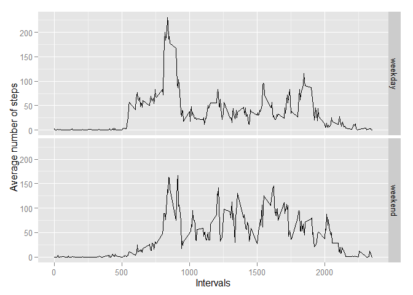

# Reproducible Research: Peer Assessment 1


## Loading and preprocessing the data


```r
data = read.csv("activity.csv")
clear_data = na.omit(data)
```

## What is mean total number of steps taken per day?


```r
totals = aggregate(steps ~ date, clear_data, sum)
hist(totals$steps, col="green", main = "Total number of steps taken per day",
     xlab = "Steps taken per day")
```

 

Calculating mean and median value:

```r
# Mean value:
round(mean(totals$steps))
```

```
## [1] 10766
```

```r
# Median value:
round(median(totals$steps))
```

```
## [1] 10765
```

## What is the average daily activity pattern?

```r
avgint = aggregate(steps ~ interval, clear_data, mean)
plot(avgint$interval, avgint$steps, type="l", 
     xlab = "Intervals", ylab = "Average number of steps", 
     main = "Average number of steps by interval")
```

 

## Imputing missing values

```r
# Quantity of the missing values is
sum(is.na(data$steps))
```

```
## [1] 2304
```

My strategy for filling in all of the missing values is to transform values from NA to the average value of this interval. For this reason I need my avgint variable. I substitute in for loop data's NA values with values calculated in variable avgint.


```r
for(i in 1:NROW(data)){
    if(is.na(data$steps[i])){
        interv = data$interval[i]
        value = avgint[avgint$interval == interv, 2]
        data$steps[i] = value
    }
}
mtotals = aggregate(steps ~ date, data, sum)
hist(mtotals$steps, col="green", main = "Total number of steps taken per day",
     xlab = "Steps taken per day")
```

 

```r
# Total number of missing values in new data set is
sum(is.na(data$steps))
```

```
## [1] 0
```

Calculating mean and median value of this new data set:


```r
# Mean value:
round(mean(mtotals$steps))
```

```
## [1] 10766
```

```r
# Median value:
round(median(mtotals$steps))
```

```
## [1] 10766
```

Some questions about new data set

* Do these(mean,median) values differ from the estimates from the first part of the assignment? - No, they particularly doesn't differ.

* What is the impact of imputing missing data on the estimates of the total daily number of steps? - We see a significant increase in the middle of the plot. I think it symbolizes that the most part of missing values came to the interval (10000, 15000) of steps taken per day.

## Are there differences in activity patterns between weekdays and weekends?

Lets devide our data by weekdays and weekends.


```r
library(ggplot2)
data = cbind(data, c("weekday_end"))
names(data) = c("steps", "date", "interval", "weekday_end")
data['weekday_end'] = weekdays(as.Date(data$date))
data$weekday_end[data$weekday_end %in% c("суббота", "воскресенье")] = "weekend"
data$weekday_end[data$weekday_end != "weekend"] = "weekday"
navgint = aggregate(data$steps, FUN = mean, 
                   list(interval = data$interval, weekday_end = data$weekday_end))
qplot(interval, x, data=navgint, type="l", facets = weekday_end ~ . , geom = c("line"),
      xlab = "Intervals", ylab="Average number of steps")
```

 

Yes, there is some difference. Weekend graph is more smooth, while weekday has very impulsive pick value between 750 and 1000 intervals.
